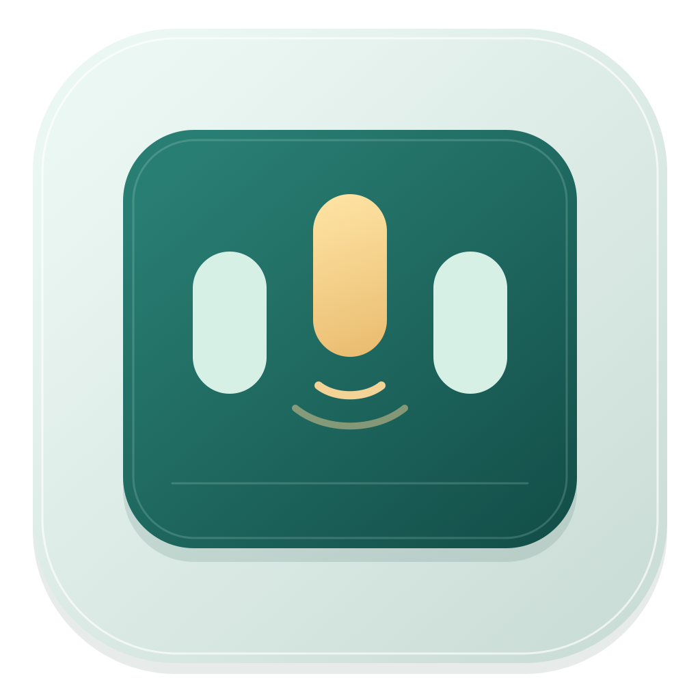
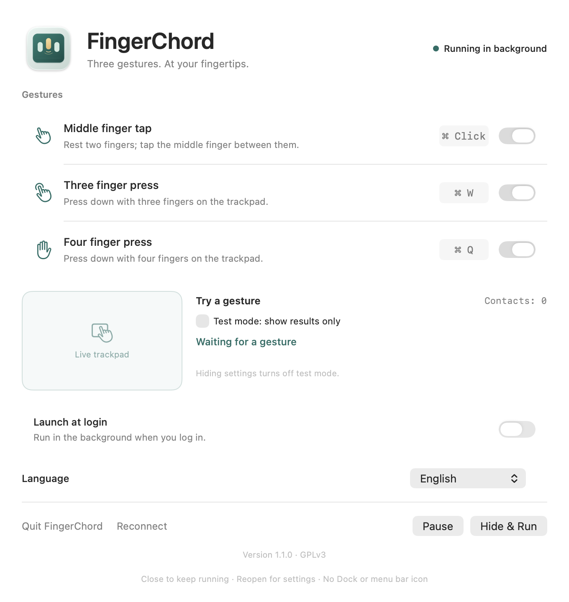
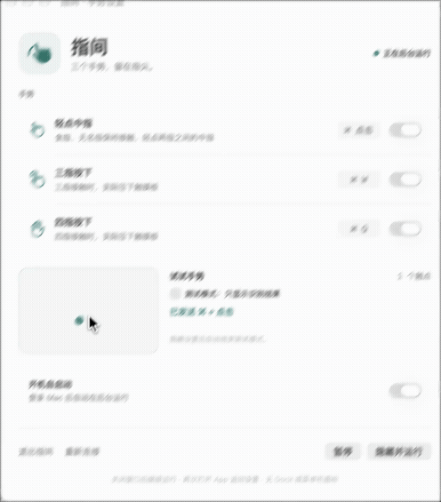

<p align="center"></p>

# FingerChord · 指间

**Three gestures. At your fingertips.** A small, native trackpad utility for macOS 27.

[简体中文](README.md) · [GPLv3](LICENSE) · [Changelog](CHANGELOG.md)

| Gesture | Action |
| --- | --- |
| Rest your index and ring fingers; tap the middle finger between them | ⌘ click |
| Physically press the trackpad with three fingers | ⌘W · Close window |
| Physically press the trackpad with four fingers | ⌘Q · Quit app |

Independent gesture switches, haptic feedback, live contact preview, a test mode and optional launch at login. Runs without a Dock or menu bar icon; reopen the app for settings. Available in English, Simplified Chinese and Traditional Chinese, with live switching and a system default option.

## Preview



[](docs/media/fingerchord-demo.mp4)

[Watch the MP4](docs/media/fingerchord-demo.mp4). The recording shows the original version; the screenshot shows the current interface.

## Use

1. Move the built `FingerChord.app` to Applications and open it.
2. Allow **Accessibility** and **Input Monitoring** in System Settings → Privacy & Security. Reopen the app if macOS asks you to.
3. When the status reads “Running in background”, try the gestures in test mode.
4. Choose **Hide & Run** or close the window. Reopen the app to change settings, pause or quit.

Test mode shows results without sending shortcuts and uses the same haptics as normal operation. Middle taps receive one app haptic; physical presses retain their native click feedback without an additional pulse. Hiding settings ends test mode. Launch at login uses `SMAppService` and is off by default on a fresh installation.

### Behavior and compatibility

- Middle taps use relative contact positions; macOS does not identify individual fingers. Rest the outer pair before tapping. Keep that pair down for repeated taps.
- Three / four finger gestures require a physical press, not a light tap. Holding a press does not repeat it. Shortcuts target the current app; ⌘ click uses the current cursor position.
- Tested on **macOS 27.0 (26A428), Apple Silicon and the built-in Force Touch trackpad**. Other trackpads, nonstandard keyboard layouts and future OS versions remain unverified.
- Uses a private system touch interface and supports macOS 27 only. OS updates may require changes. System gesture preferences are left intact.
- With gestures enabled, native trackpad clicks may be delayed by up to 80 ms to match physical button events. Unmatched clicks pass through. External mouse clicks are not delayed.

## Build

Requires **macOS 27, Xcode with the macOS 27 SDK, and Swift 6.2+**. From the source directory:

```sh
./scripts/test.sh
./scripts/build.sh             # dist/FingerChord.app
./scripts/install.sh           # /Applications/FingerChord.app
./scripts/package-release.sh  # ZIP archive and SHA-256 checksum
```

Quit an existing instance before installing. Open `Package.swift` in Xcode for development. Swift, AppKit and SwiftUI are the only runtime requirements; the build downloads no third-party dependencies.

The build prefers an installed Developer ID / Apple Development certificate, falling back to ad-hoc signing. Set `FINGERCHORD_SIGN_IDENTITY` to override it (`-` forces ad-hoc signing). Keep the same install path, bundle ID and signing identity to help preserve system grants. Ad-hoc rebuilds may require permissions again. Local builds are **not notarized** and may be blocked by Gatekeeper on another Mac.

[Development, diagnostics and validation](docs/DEVELOPMENT.md) · [Contributing](CONTRIBUTING.md)

## Privacy

All recognition runs locally. No network requests, keyboard text collection or application-content recording. Settings use local UserDefaults. Diagnostics are off by default; an explicit recording captures touch coordinates, button states and status events for at most three minutes or 10,000 entries. The file is stored at `~/Library/Application Support/FingerChord/diagnostic.json` and never uploaded automatically. Recording buffers are released when capture stops; the file remains until deleted.

## Built one-shot with GPT 6 Astra

This application was built **one-shot** with the **GPT 6 Astra** model, starting from the [original prompt](docs/ORIGINAL_PROMPT.md), followed by testing and refinements on the actual Mac. The full original prompt is also included in the [Chinese README](README.md#由-gpt-6-astra-one-shot-构建).

## License

Original code, SVG artwork and documentation: [GNU GPL v3.0](LICENSE), `GPL-3.0-only`. Interface references and their license notices are listed in [Acknowledgments](ACKNOWLEDGMENTS.md).
