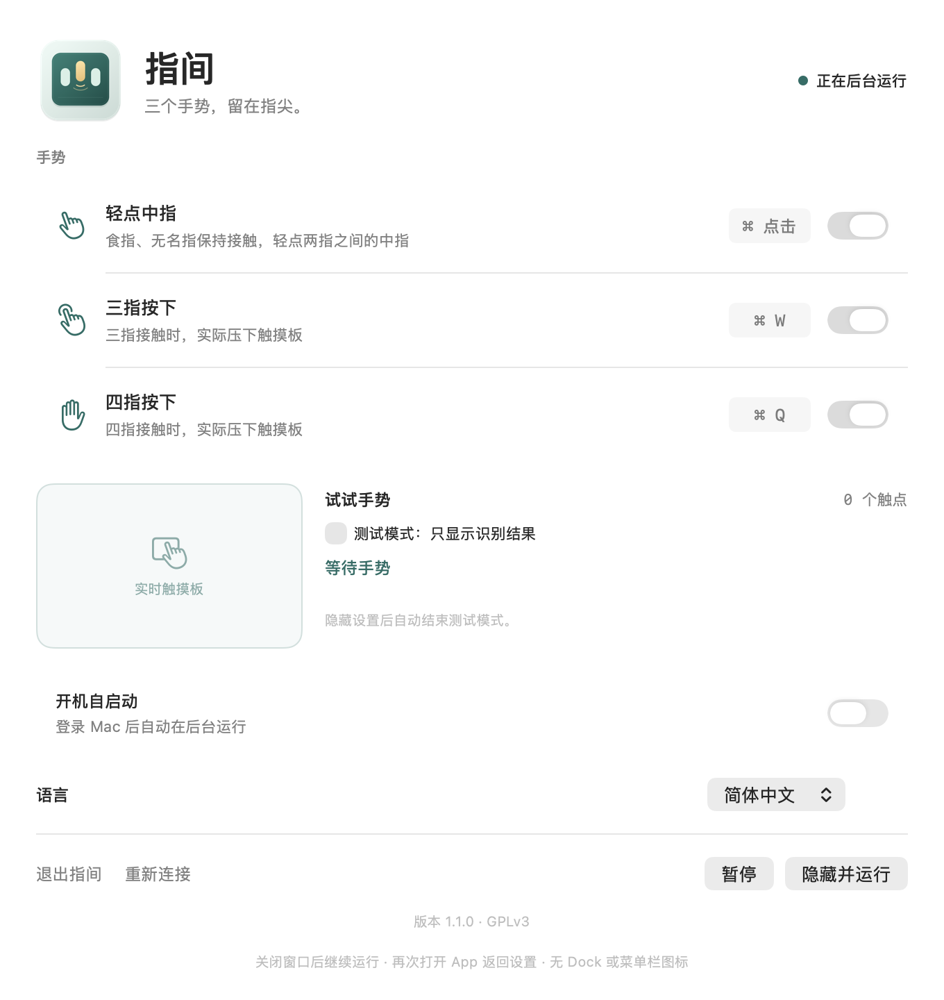

<p align="center"></p>

# 指间 · FingerChord

**三个手势，留在指尖。** 为 macOS 27 打造的轻量触摸板工具。

[English](README.en.md) · [GPLv3](LICENSE) · [更新记录](CHANGELOG.md)

| 手势 | 动作 |
| --- | --- |
| 食指、无名指保持接触，轻点两指之间的中指 | ⌘ + 点击 |
| 三指接触时，实际压下触摸板 | ⌘W · 关闭窗口 |
| 四指接触时，实际压下触摸板 | ⌘Q · 退出应用 |

- 每个手势独立开关，成功识别时提供触觉反馈。
- 实时触点预览和测试模式，方便确认手势。
- 后台运行，无 Dock 图标、无菜单栏图标；再次打开 App 返回设置。
- 支持登录时启动，以及简体中文、繁體中文、English，默认跟随系统。
- 原生 Swift / AppKit / SwiftUI，无第三方运行时依赖、无网络请求。

## 预览



### 手势演示

[](docs/media/fingerchord-demo.mp4)

[观看 MP4 视频](docs/media/fingerchord-demo.mp4)。演示录于初版，当前界面见上方截图。

## 使用

1. 将构建产物 `FingerChord.app` 放入「应用程序」，双击打开。
2. 按提示在 **系统设置 → 隐私与安全性** 中允许「辅助功能」和「输入监控」。列表中可能显示「指间」或「FingerChord」。如系统要求重新打开，请照常操作。
3. 状态显示「正在后台运行」后，在测试模式里尝试手势。
4. 点击「隐藏并运行」或关闭窗口。再次打开 App 可调整设置、暂停或退出。

测试模式只显示结果并提供震动，不发送快捷键；隐藏设置后自动结束测试模式。登录启动由系统 `SMAppService` 管理，新安装默认关闭，可在设置中开启。

### 手势说明与兼容范围

- 中指轻点按触点的相对位置识别，系统无法直接辨认手指名称。先让两侧手指稳定，再轻点中间；两侧无需抬起即可连续使用。
- 三指、四指需要**实际压下**，仅轻触不会发送 ⌘W / ⌘Q；按住不重复触发。快捷键作用于当前应用，⌘ 点击作用于当前光标位置。
- 已在 **macOS 27.0 (26A428)、Apple Silicon、内置 Force Touch 触摸板**实测。其他触摸板、非标准键盘布局及未来系统版本尚未完成实机验证。
- 使用系统私有触点接口，只支持 macOS 27；系统更新可能需要适配。系统手势设置不会被修改。
- 开启手势时，触摸板原生点击最多延后 80 ms，以匹配较晚到达的物理按钮事件。未匹配的点击正常转发，外接鼠标不延后。

## Build

需要 **macOS 27、含 macOS 27 SDK 的 Xcode、Swift 6.2+**。下载源码后进入项目目录：

```sh
./scripts/test.sh             # 手势、翻译和生命周期单元测试
./scripts/build.sh            # 构建并签名 dist/FingerChord.app
./scripts/install.sh          # 构建、安装到 /Applications 并打开设置
./scripts/package-release.sh  # 生成 ZIP 和 SHA-256 校验文件
```

安装前先从设置中退出旧版。Xcode 也可以直接打开 `Package.swift`。构建不下载第三方依赖。

构建脚本优先使用本机 Developer ID / Apple Development 证书，无证书时使用 ad-hoc 签名。可通过 `FINGERCHORD_SIGN_IDENTITY` 指定身份，设为 `-` 强制 ad-hoc。保持安装路径、bundle ID 和签名身份不变，有助于保留系统权限；ad-hoc 重构建可能需要重新授权。本地产物**未公证**，不承诺在其他 Mac 上直接通过 Gatekeeper。

[开发、诊断及验证记录](docs/DEVELOPMENT.md) · [参与贡献](CONTRIBUTING.md)

## 隐私

手势在本机处理，不采集键盘文本或应用内容，不联网。设置保存在本机 UserDefaults。诊断默认关闭；手动开启后最多记录三分钟或 10,000 条触点、按钮及状态事件，保存在 `~/Library/Application Support/FingerChord/diagnostic.json`，不会自动上传。结束记录后释放内存缓冲；本地文件会保留，可自行删除。

## 由 GPT 6 Astra one-shot 构建

此应用由 **GPT 6 Astra** 模型以 **one-shot** 方式构建。开发从下面这份需求开始，再通过实机测试完善。

<details>
<summary>查看最初的 Prompt</summary>

```text
请从零开始为我们开发一个本地使用的小工具。运行环境仅需兼容当前 macOS 27。
功能：全局侦听触摸板事件，帮我们实现自定义手势。
目前手势仅有：
1. 食指+无名指触碰在触摸板上时，轻点中指，模拟 CMD + 点击事件。
2. 三指在触摸板按下，模拟 CMD + W。
3. 四指在触摸板按下，模拟 CMD + Q。

背景：BetterTouchTool 曾经有此功能，但是它在最新的 macOS 27 上面有其他兼容性问题，无法继续使用。
本工具纯粹自用，只要在我们本地可以正常运行即可。
请自行创建 Git，并且实时 commit。
交付的最终产物应该是一个可用的 App，点击开始运行，运行时没有图标，没有 Dock 图标，没有顶栏图标。
再次点击启动一个设置窗口，有所有手势的开关，以及开机自启动开关。
```

</details>

## 许可证

代码、原创 SVG 图标和文档采用 [GNU GPL v3.0](LICENSE)（`GPL-3.0-only`）。接口参考及其许可见 [致谢](ACKNOWLEDGMENTS.md)。
